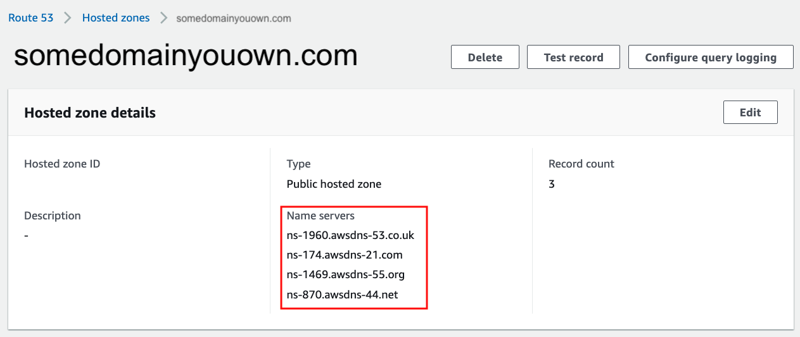
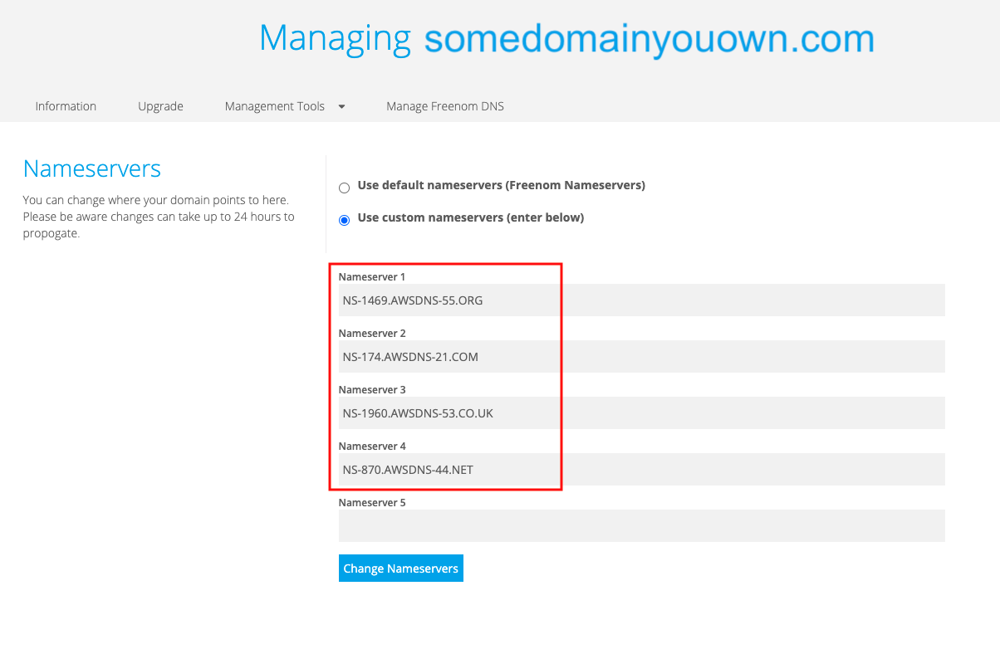

# PayID via AWS Lambda

Ready to get started with your own PayID server on AWS Lambda?

You'll need:
* an AWS account.
* a domain you want to use for your Pay IDs.
* [a certificate imported into Amazon Certificate Manager in the `us-east-1` region](#how-do-i-get-a-certificate-in-amazon-certificate-manager). (you'll need the ARN to pass to the stack)
* __after the stack is added__, you'll have [to update your domain to use Amazon's name servers in the Route53 hosted zone that's created for you](#how-do-i-update-my-domains-nameservers-for-my-payid-domain).

If you have the domain and certificate, and you're okay with using Amazon's name servers, then click the button below to get started. 

## How do I get a certificate in Amazon Certificate Manager?

Note: this is a set of instructions known to work by those who created this stack, but there are likely other ways of importing a certificate. This guide only seeks to show the steps for the one used during our development of this CloudFormation stack.

### Step 1: Open up the Certificate Manager in the AWS console in us-east-1

Note: this __must__ be added in the `us-east-1` region or the CloudFormation will not create your stack/PayID server correctly. The reason for this is that the Lambda uses API Gateway for HTTP access which leverages a Cloudfront distribution for pointing a domain to it, and Cloudfront distributions require ACM certs to exist in `us-east-1.  This is mentioned on the AWS documentation [here](https://docs.aws.amazon.com/acm/latest/userguide/acm-regions.html).

Link to console:
https://console.aws.amazon.com/acm/home?region=us-east-1

### Step 2: Request a public certificate

### Step 3: Specify your domain name

### Step 4: Choose DNS valication

### Step 5: Add tags (optional)

### Step 5: Review

### Step 6: Pending validation and adding a CNAME at your registrar

At this point, you've gone as far as you can in the AWS console and will be in a state pending validation as shown below:

You'll need to use that information with your registrar to add a `CNAME` record so ACM can validate that you own the domain. Here's an example of what this looks like on the registrar we used:

### Step 7: Wait for issuance (probably 30-ish minutes)

Now you'll just have to wait for ACM to see the `CNAME` you added and issue the cert. After this happens you should see the status change:

### Step 8: Copy the certificate ARN for use with this CloudFormation stack

## How do I update my domain's nameservers for my PayID domain?

Once you have finished creating the CloudFormation Stack using our template, you'll need to update your nameserver settings on your registrar to use Amazon's. 

### Step 1: Go to Route53 in the AWS console and click on your hosted zone

Link to Route53:
https://console.aws.amazon.com/route53/v2/hostedzones

Once you're on this page, click on the domain you used in the stack template (in this example, `somedomainyouown.com`):

### Step 2: Find the nameservers

Clicking on the hosted zone will display the nameservers you need to use with your registrar:

### Step 3: Update your registrar with Amazon's nameservers

Paste the values you saw in the previous step into wherever your registrar allows you to change them. For example:

